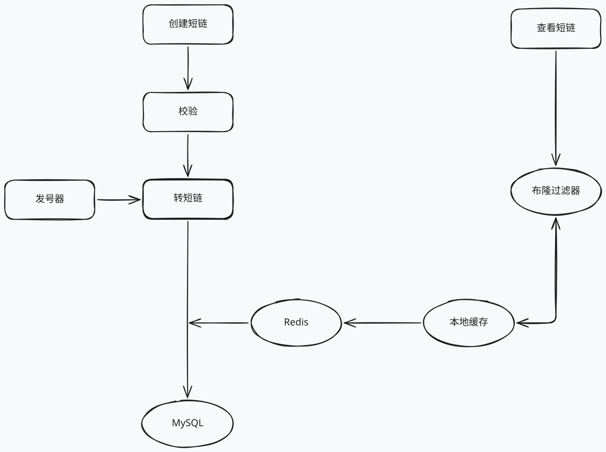

# 短链接项目 

## 1. 建库建表
在真实项目中要将两个表放在不同数据库中
1. 发号器
```sql
CREATE TABLE `sequence` (
  `id` bigint(20) unsigned NOT NULL AUTO_INCREMENT,
  `stub` varchar(1) NOT NULL,
  `timestamp` timestamp NOT NULL DEFAULT CURRENT_TIMESTAMP ON UPDATE CURRENT_TIMESTAMP,
  PRIMARY KEY (`id`),
  UNIQUE KEY `idx_uniq_stub` (`stub`)
) ENGINE=MyISAM DEFAULT CHARSET=utf8 COMMENT = '序号表';
```
2. 长短链映射表
```sql
CREATE TABLE `short_url_map` (
    `id` BIGINT UNSIGNED NOT NULL AUTO_INCREMENT COMMENT '主键',
    `create_at` DATETIME NOT NULL DEFAULT CURRENT_TIMESTAMP COMMENT '创建时间',
    `create_by` VARCHAR(64) NOT NULL DEFAULT '' COMMENT '创建者',
    `is_del` tinyint UNSIGNED NOT NULL DEFAULT '0' COMMENT '是否删除：0正常1删除',
    
    `lurl` varchar(2048) DEFAULT NULL COMMENT '长链接',
    `md5` char(32) DEFAULT NULL COMMENT '长链接MD5', 
    `surl` varchar(11) DEFAULT NULL COMMENT '短链接',
    PRIMARY KEY (`id`),
    INDEX(`is_del`),
    UNIQUE(`md5`),
    UNIQUE(`surl`)
)ENGINE=INNODB DEFAULT CHARSET=utf8mb4 COMMENT = '长短链映射表';
```

## 2. 编写 api 文件
编写后生成 gozero 代码:
```bash
goctl api go -api shorturl.api -dir .
```

## 3. 根据数据库的表生成对应的代码
```bash
goctl model mysql datasource -url="root:root123456@tcp(127.7.7.1:13306)/shorturl" -table="sequence" -dir="./model"
```
```bash
goctl model mysql datasource -url="root:root123456@tcp(127.7.7.1:13306)/shorturl" -table="short_url_map" -dir="./model"
```

##  4. 配置 shorturl-api.yaml 和 config.go 中的数据库配置
在 shorturl-api.yaml 中加入这两条:
```yaml
SequenceDB:
  DSN: root:root123456@tcp(localhost:3306)/shorturl?charset=utf8mb4&parseTime=True&loc=Asia%2FShanghai
ShortURLDB:
  DSN: root:root123456@tcp(localhost:3306)/shorturl?charset=utf8mb4&parseTime=True&loc=Asia%2FShanghai
```
config.go中加入两个DB
```go
type Config struct {
	rest.RestConf
	SequenceDB struct {
		DSN string
	}
	ShortUrlDB struct {
		DSN string
	}
}
```

## 5. 将两个 db model 引入到 svc 中
在 internal/svc/servicecontext.go 中加入 ShortUrlModel 和 SequenceModel
```go
type ServiceContext struct {
	Config        config.Config
	ShortUrlModel model.ShortUrlMapModel
	SequenceModel model.SequenceModel
}

func NewServiceContext(c config.Config) *ServiceContext {
	sUrlConn := sqlx.NewMysql(c.ShortUrlDB.DSN)
	seqConn := sqlx.NewMysql(c.SequenceDB.DSN)

	return &ServiceContext{
		Config:        c,
		ShortUrlModel: model.NewShortUrlMapModel(sUrlConn),
		SequenceModel: model.NewSequenceModel(seqConn),
	}
}
```
## 6. 编写业务代码

## 7. 编写单元测试为某些函数
可以用 vscode 自动生成测试框架
目前只为 pkg 中的工具函数编写了单元测试